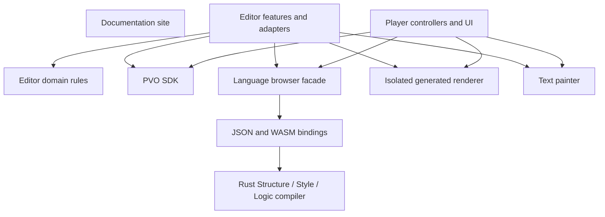

# Architecture and ownership

The documentation, editor, player, SDK, and Rust language compiler have distinct source areas. UI and host adapters consume shared packages through their public entry points. Folder ownership follows the coding rules in [AGENTS.md](../../AGENTS.md); current remaining work is in the [audit](code-audit.md).

## Repository map

```text
pvo-prototype/
  AGENTS.md                     Repository-wide agent rules
  README.md / SPEC.md            Setup overview and canonical package format
  docs/
    site/                       Documentation website at /docs/
    language/                   PVO Structure, Style and Logic authoring guide
    engineering/                Standards, architecture and current audit
  editor/                       React/TypeScript recording and authoring app
  player/                       Standalone viewing app
  packages/
    pvo-sdk/                    Format containers, validation and action runtime
    pvo-language/               Native Rust compiler and browser WASM facade
    pvo-code-runtime/           Isolated generated renderer and host bridge
    pvo-text-runtime/           Shared text styles and painter
    pvo-component-runtime/      Shared no-code presets and bounded appearance values
  scripts/
    build/                      WASM, static site and sample/demo preparation
    dev/                        Static development server
    checks/                     JavaScript checks and browser suites by owner
  tests/                        Node behavior tests
  share/                        Demo landing page and assets
  assets/ / examples/           Media and format fixtures
  dist/                         Generated deployment tree
```

The product home `/` opens the camera/editor application under `/editor/`; mobile home selects the existing camera after recovering the local draft, while landscape tablet/desktop home (1024px and above) shows the create-project studio. `/player/` opens local files and `/player/{id}` opens a published export through the Worker. Demo and documentation pages are excluded from product output. The documentation website uses its own HTML, CSS, and JavaScript in `docs/site/`, with a separate `npm run build:docs` output. Engineering and language Markdown are repository guides, not automatically rendered website pages.

`server/` owns Cloudflare routing, creator authentication, publication rules and D1/R2 adapters. Its entry point delegates to focused route modules; uploaded media is stored in R2 and ownership/lifecycle records in D1. Editor and player consume the same HTTP publication boundary without importing server internals. The independent `server/assistant/` service uses Workers AI and the shared PVO compiler to propose component source through `/api/assistant`. A Durable Object per UTC day reserves a bounded inference budget, including repair attempts, without storing prompts or source. Assistant availability does not depend on publication sign-in. See [publishing setup](cloudflare-publishing.md), the [product flow](publishing-plan.md), and the [orb assistant](orb-assistant.md).

## Dependency direction



Editor and player must not import each other's internals. Packages must not import their consumers. The Rust compiler owns deterministic parsing, validation, compilation, diagnostics, and capability rules; it does not perform requests or playback. Bindings expose its contracts, and the JavaScript facade initializes WASM. Hosts validate events and execute checked outcomes.

Editor domain code depends on project data and package contracts, not React, Zustand, DOM elements, or UI state. Browser-oriented packages such as the renderer and text painter legitimately use browser capabilities. The generic SDK supports host handlers and retains its existing default network/browser behavior.

## Editor organization

```text
editor/src/
  app/                          App/editor composition, sheets and keyboard wiring
  domain/
    project/                    Models, snapshots, ratios and numeric rules
    clips/                      Timing and pure split/delete rules
    audio/                      Extracted audio and source ranges
    scenes/                     Naming, scene references and total duration
    layers/                     Layer identity and ordering
    components/                 Defaults, Fields/PVO source mapping, outcomes and response timing policy
    assistant/                  Review, request context and proposal validation
    notifications/              Approved events, short copy, priority and repetition rules
    export/                     Pure project-to-manifest construction
  state/
    captureStore.ts / types.ts   Store composition and shared state contracts
    project/                    Initial state, history, session reset and scene sync
    components/                 Component commands, authoring state and measurements
    scenes/                     Scene commands and outcome routing
    editing/                    Clip, text, layer and overlay editing commands
    assistant/                  Proposal session state and Keep command
    auth/                       Sign-in and export gate state
    export/                     Completed export and publication attempt state
    notifications/              Ephemeral notices and retained issues
    preferences/                Device editing and motion preferences
  features/
    capture/                    Camera, recorder and recording UI
    editor-layout/              Docked panels, resize gestures and viewport measurements
    desktop-editor/             Landscape Library, Player, Inspector and Timeline presentation
    timeline/                   Tracks, geometry, dragging and clip commands
    preview/                    Video, overlays and Try-mode host integration
    assistant/                  Orb presentation, session orchestration and browser voice
    notifications/              Top notices, retained issues and accessible dismissal
    scenes/                     Scene selection UI
    text/                       Text authoring and overlay UI
    component-authoring/
      fields/                   Structured content editor
      look/                     Preset previews and scoped appearance controls
      outcomes/                 Requests and playback-route configuration
      language/                 Structure/Style/Logic editor and diagnostics
    export/                     Export orchestration, progress and download UI
    settings/                   Settings views and their styles
    sound/                      Music selection, audio layers and playback wiring
  infrastructure/               Media export, audio, language compilation, IDs
  ui/                           Shared icons, ratio menu, sheet frame, time formatting
  store.ts                      Stable compatibility API for existing consumers
  fonts/                        Existing font assets
```

These folders now exist. `app/Editor.tsx` composes focused views instead of implementing the full timeline and preview. `state/captureStore.ts` composes state behavior; domain models no longer live in the store. Keyboard and toolbar splitting/deletion share one command layer. Manifest mapping takes a project snapshot and compiled language data, while the export workflow owns compilation, media rendering, progress, and packaging.

State files are grouped by the responsibility they own. `state/project/` integrates project history and scene mirrors; feature command folders apply domain rules through the composed store. Transient authoring, assistant, authentication, export and notification state stays with its own owner. Import these modules directly; the existing `store.ts` compatibility API remains the shared entry point for existing consumers.

`features/editor-layout/` keeps navigation, preview, transport and the lower panel in one measured layout. Panel height is local presentation state, outside project history. Component sheets inherit the timeline height when opened and clamp their maximum to keep the player, transport and header visible. Other panels retain their fullscreen expansion; those regions stay mounted and return when space becomes available. Shared shells use `ui/sheets/SheetDockContext.tsx` to register their dismissal and expansion behavior; the camera renders the same shells without a dock provider. Timeline picking hides the panel without unmounting its draft, then restores it. Try hides the lower region and restores its height alongside the original scene, playhead and selection when the session stops. OS keyboard viewport changes temporarily fit the sheet around the focused field without replacing its preferred height.

Timeline and sheet panels share `usePanelResize` and `PanelResizeHandle`, with independent size state. Sheets may dismiss when pulled down; the timeline stops at a usable minimum. `useTimelineMeasurements` reads the natural track content and fixed scene/toolbar controls to determine the default and minimum, independently of the height allocated while dragging. The timeline's existing scroll container fills the remaining space without changing layer coordinates or editing commands.

The workspace owns top and side system safe-area padding outside its resizable grid. `useWorkspaceMeasurements` measures the usable height after that padding, so fullscreen and every intermediate size keep their drag handles below the status bar. Header and panel shells must not add another top inset. Bottom clearance belongs to the timeline toolbar and sheet scroll content.

`features/preview/useOverlayGestures` owns pointer capture, contact transitions and gesture cleanup. `state/editing/overlayTransform` previews edits through the existing text/component commands, rolls back cancellation and records one history snapshot on completion. Position limits live in `domain/layers/transform`; shared scale validation lives in `pvo-component-runtime`, with proportional pinch rules in `domain/components/scale`. Timeline component drags follow the same shape: `state/components/componentTimingDrag` previews start and duration through the component command, rolls back cancellation and records one snapshot on completion, while the start margin and minimum duration live in `domain/components/timing`. Optional component scale defaults to one for older projects. Independent `scaleX`/`scaleY` override their respective axes and travel through the existing `restyle_capture` export metadata; the player scales Fields and PVO renderers around their centers. Mobile keeps its existing tools, and pinching preserves the authored proportions. App touch policy prevents page pinching without replacing native single-finger scrolling.

Desktop and tablet Look tools expose Width and Height in canvas pixels through `features/component-authoring/size`. The fixed authoring canvas has a 1080px short edge, independent of window size and export quality. Explicit component `width`/`height` persist through history, checkpoints and export. `domain/components/pixelSize` retains the other axis when committing a dimension through the component command. `state/components/componentMeasurements` holds only transient natural bounds reported by the preview; they never enter project history. A shared runtime observer reads untransformed layout bounds so editor and player can fit both visual and code-owned content to the requested pixels. Each renderer disconnects its observers on removal.

The [orb assistant](orb-assistant.md) keeps uncommitted proposals in a session store, outside project persistence and history. `features/assistant/` coordinates its views and voice adapter; `domain/assistant/` owns review and project-context rules; `infrastructure/assistant/` calls same-origin `/api/assistant` or an explicit HTTP override and compiles the exact returned PVO. `packages/pvo-assistant/` shares bounded JSON parsing and compiled proposal policy with the server. There is no local preset fallback. Only `state/assistant/assistantCommands.ts` commits a kept proposal through normal component history.

Keep new feature code in its owning folder rather than expanding the compatibility `store.ts` facade. Crop/speed, sound and discard sheets have feature owners; `app/Sheets.tsx` only selects the view. Timeline pointer wiring calls pure clip/text timing rules through state commands. Component timing keeps its existing transaction command. Export sessions and camera controls have dedicated hooks, and each Try session owns its runtime through explicit host adapters. Persistence accepts a project/history/resume snapshot rather than the complete capture store.

Feature CSS is co-located with its views. `EditorStyles.module.css` imports the extracted styles in their original cascade order, retaining a single compatibility namespace for existing `cx` consumers and pointer hooks. New independent feature modules can continue using their own CSS modules. Further migration of the compatibility namespace and shared fonts is separate work.

### Try diagnostics

Try records a bounded, transient diagnostic run even when its panel is closed. The SDK exposes optional typed observation callbacks for actions, requests and state; the sandbox and host adapters add readiness, input and playback facts. Observer failures cannot reject an action. Shared packages never import the editor or its UI, and the standalone player can expose the same facts without mounting authoring tools. Diagnostics do not introduce PVO syntax or enter manifests, project saves, exports or undo history.

`domain/debugging/` owns diagnostic models, grouping, readiness, safe report construction and presentation-independent status rules. `state/debugging/` owns the current run and capture switch. The preview session supplies correlation identities and video position, while media adapters distinguish a requested action from actual media observations. Requests run independently of playback status: a running request alone does not mean the video is paused, and a missing HTTP status does not prove a server outage.

`features/try-debugger/` renders the shared Activity, State and Requests views. The mounted workspace explicitly chooses a desktop dock or mobile sheet; `features/editor-layout/debugging/` owns panel geometry, entry controls and navigation commands. The timeline and editing sheets remain mounted behind the diagnostic panel. Inspection and Locate do not seek, replay or mutate components. Stop and edit invokes the existing Try stop and authoring commands. The run survives Stop, is replaced by the next Try, and is discarded on project change or reload.

Capture is off for each new run and applies only to subsequent requests. Data is bounded and private string values are masked. Copied reports always exclude request/response bodies, state values, raw exception messages, headers, URL query values and credentials. Retention limits are explicit in the panel/report. There are no remote log uploads, step execution, state editing or automatic request retries.

The component sheet separates Content, Look and Action. Timing belongs to Content; Advanced is a device preference that exposes another editable view of the same component. `domain/components/` owns source/visual projection, exact appearance edits, named form fields and draft transitions. Source-backed rendering does not imply a visual editing lock. Pending or invalid drafts temporarily block Content and Look updates while retaining the draft and last validated source for explicit recovery. `componentAuthoringStore` holds only the selected tab and part, outside project history. Focused text edits and continuous colour gestures use the existing undoable command boundary.

Simple Action controls expose local playback routes. The Advanced switch reveals the PVO source editor for Structure, Style and Logic; network requests are authored directly in Logic, without a visual request setup panel. Forms store `fields.formSubmitMode: "local"` or `"request"`; compiling a request action projects `"request"` into the form fields. Native exports carry the mode in `restyle_capture.form.submitMode`, so Try and the standalone player agree about whether form submission needs a network destination. Visual content and appearance edits preserve authored request methods, payloads and field identifiers.

`pvo-component-runtime` contains pure, validated appearance values used by the editor and standalone player. Visual component exports retain native manifest controls plus `restyle_capture` appearance/form metadata; code-owned components use the isolated PVO renderer. Both routes keep request destinations and playback outcomes under the existing checked host adapters. Form submission status follows the actual response.

The [desktop editor](desktop-editor.md) uses the approved Library / Player / Inspector / Timeline layout at 1024px and above in landscape. It shares the project route, capture store, playback runtime, history and authoring commands with the existing narrow/portrait editor. Desktop library insertion and selection commands own atomic history boundaries; the Inspector adapts the existing component editor to a side panel. Unsupported transcript and video-processing capabilities remain explicitly unavailable rather than changing only the preview.

Clip sound remains attached until the user selects **Extract audio**. `domain/audio/` owns independent source ranges and timeline positions; `domain/scenes/duration` determines the full authored duration from video, audio and explicit visual-layer ends. `state/editing/audioCommands` commits extraction, timing gestures, split/delete and history. Optional `Scene.audioClips` preserves compatibility with older projects, while `Clip.audioDetached` prevents the source video from also playing its sound. Extracted layers retain their media reference when the video is edited or deleted. Checkpoints, history, scene duplication, ID recovery and export snapshots include these references. The shared audio bar serves both timelines. `infrastructure/audio/audioLayerPlayer` owns preview/export audio elements and cleanup; rendered video and PVO scene media include the mix, with black frames when any authored layer extends beyond the video.

## Player and SDK organization

```text
player/
  app.js                        Session creation and controller wiring
  playback/                     Session state, timeline queries, transitions
  actions/                      SDK host adapter, component events, outcome routing
  media/                        Package loading, video control, object URL ownership
  components/                   Views, visibility, overlays, compiled PVO source
  ui/                           DOM references, controls and event bindings
  index.html / styles.css       Entry document and current app styling

packages/pvo-sdk/
  index.js / index.d.ts          Stable public API and declarations
  container/                    Binary input, PVOPACK1, legacy MP4/MOV, read dispatch
  manifest/                     Constants, manifest and action validation
  runtime/                      State paths, conditions, request policy, execution
```

The player owns an explicit per-viewer session and passes capabilities to controllers. Rendering, media access, action execution, and playback decisions have separate owners. Some controllers still combine decisions with host coordination; they are not all pure domain functions.

SDK public import paths, exports, declarations, schema, and container bytes describe the current development contract. Contract changes replace superseded shapes instead of adding compatibility paths. The publication list includes internal module folders. The static build copies the player and JavaScript package trees so their relative imports work after deployment.

## Rust language organization

```text
packages/pvo-language/
  Cargo.toml / Cargo.lock        Native crate and reproducible dependency resolution
  src/
    lib.rs                      Stable native public facade
    bindings.rs                 JSON envelopes and wasm-bindgen exports
    diagnostic.rs               Shared source-position diagnostics
    structure/                  Models, parsing and component-shape validation
    style/                      Syntax, scoped output and allowed visual values
    logic/                      Models, token reading, event grammar, route validation
    compiler/                   Whole-component compilation and escaped rendering
  tests/                        Public-API suites for each compiler responsibility
  index.js / index.d.ts          Browser facade and TypeScript contract
  pkg/                          Generated browser bindings and WASM; ignored
  target/                       Cargo build cache; ignored
```

See the [package ownership guide](../../packages/pvo-language/README.md) for internal roles and the [language guide](../language/README.md) for authoring syntax. Compiler validation, runtime host enforcement, and rendered component events are distinct responsibilities. Do not move DOM, network, or editor state into the Rust rules.

`pvo-code-runtime/index.js` preserves the public API. Source limits/protocol constants, token substitution, handler parsing, sanitization, runtime-document generation and rendering each have an internal owner. `session.js` coordinates the frames, event queue, request replies, watchdog and disposal. Browser isolation checks cover this boundary. Keep the focused text painter intact unless a real second responsibility emerges.

## Build and verification

[Scripts and prerequisites](../../scripts/README.md) document stable npm commands and the grouped suites. `npm run check` checks JavaScript syntax, the declared dependency boundaries and Node behavior tests. Rust has native/format checks; browser fixtures verify compiler, editor, player and isolation behavior. The CI workflow installs locked Node dependencies and wasm-pack, then checks Rust formatting/tests, the production build, JavaScript/Node and editor types. Browser suites remain explicit local checks.

The production build includes the language facade and generated `pkg/`, not Cargo sources or `target/`. It replaces `dist/`; use an isolated build tree when existing generated output must be preserved. Player fonts still copy from `editor/src/fonts`; independent shared font ownership remains a follow-up. Node tests still use `tests/*.test.mjs`; change test discovery if moving those into nested folders.
