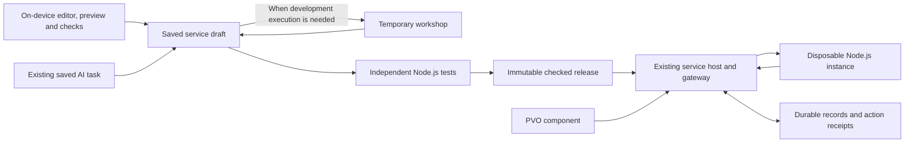

# 1G: Containers — one service system, with editable Node.js code

[Roadmap overview](../restyle-cloud-agent-roadmap.md) · [Architecture](../restyle-cloud-agent-architecture.md#containers-the-next-product-feature) · [Current evidence](../restyle-cloud-agent-progress.md)

**Status: implementation started, 7 October 2026.** 1E/1F are verified through beta. **1G.01–1G.03, 1G.07, 4B.01–07 and 4C.01/04/05 are complete**; the [implementation contract](../restyle-containers-contract.md) records the shared draft/release rules, zero-workshop cases and required Node.js proof. Remaining implementation and provider acceptance stay unchecked. Production is deferred until the user tests the finished work in beta.

## The simple version

A **Component** is what viewers see and press. A **Container** is the saved, hosted Node.js service behind it. The **workshop** is the temporary computer the AI uses to develop that service.

Think of the **VM as the workshop**, the **Container as the finished service**, **storage as the filing cabinet**, and the **Component as the front desk**. The workshop builds and repairs; the service handles visitors; the filing cabinet keeps the information when either computer stops. Technically, the workshop itself can run in a provider container: these names distinguish their jobs and lifetimes.

Creators open **Containers** outside the Components area. They can inspect the AI's JavaScript, edit it themselves, ask the AI to continue from those edits, test the saved draft, and publish a checked version. A component selects an approved operation from that Container. Restyle supplies the connection; the creator does not arrange hosting or paste a server URL.

The Container has a lasting identity even when its running instance stops. Its code, published versions and records live in Restyle's durable storage. Restyle can start another instance from the same saved release when needed. An idle instance stopping is different from the creator pausing the service.

## Where work runs: use the device first where it fits

**Reviewed decision:** use the creator's device for editing, previews and lightweight checks; start a temporary cloud workshop only when development needs it. Keep independent publication checks, the finished viewer service and shared records under Restyle's control. There is no permanently assigned running VM per creator.

| Job | Where it runs | Everyday reason |
| --- | --- | --- |
| Edit code and components, show previews, check syntax/field shapes with supported tools | User's device | Give quick feedback using the computer or phone already open. No workshop starts for these actions. |
| Save the shared draft, keep AI progress/questions, call the hosted model | Existing Restyle server and saved task | Both editors see the same saved work. An AI conversation or ordinary code patch does not itself need a VM. |
| Install approved dependencies, run Node.js tools, execute heavier development tests | Temporary cloud workshop, when required | Provide the tools and consistent environment the task needs. Save work and stop idle compute. |
| Independently verify the exact release before publishing | Restyle-controlled isolated Node.js execution | A result reported by the browser or generated tests cannot approve its own release. This check is required even if development happened locally. |
| Handle viewer requests and keep shared records | Hosted Container plus durable storage | The feature continues working when the creator's device is off. An idle instance can sleep without erasing the service. |

For the dinner example: arrange and preview the form on the phone; use a workshop if the AI needs to run development tools for the capacity rule; independently test the finished code before publishing; then the hosted Container records friends' replies while the phone is off.

### How Restyle chooses

Use the existing task coordinator and workspace adapter. Record why a development execution is needed and reserve its permitted resources before starting it. Reading a draft, saving edits, answering questions and running supported local checks must not automatically provision a workshop. A small AI edit can update the same revision-checked draft directly; execution-dependent work opens a disposable workshop from that saved revision.

If local work is interrupted, recover the last saved draft and show any unresolved local save honestly. Cloud work can resume from its saved task without keeping the browser open; only bytes actually saved to Restyle are available there. Closing the page does not authorize a new paid build. Previously authorized queued work still follows its saved permission and capacity controls. A suspended browser must not be reported as still running local tests. Browsers can freeze or discard background pages; see [the browser lifecycle documentation](https://developer.chrome.com/docs/web-platform/page-lifecycle-api).

Keep the first version small: reuse the existing browser editor, component sandbox and shared validation rules. Execute only supported checks through those boundaries. A full on-device Node.js environment, desktop installer, or second local agent runner is future work requiring evidence of enough savings to justify its complexity. Ordinary app JavaScript must not directly execute arbitrary generated backend code. The saved service and publication contract is the same wherever development work happens.

**Cost expectation:** local work can reduce workshop runtime. Hosted model calls, independent release checks, the live service and retained storage still have costs. Measure workshop starts, active/idle time, validation time and retained storage separately; record estimates and actual observations before promising savings. Stop unused workshop compute after saving, with cleanup retried from durable records.

## Consolidation: what we reuse and what changes

**Container is the product name for the existing owned service.** Keep its `serviceId`, owner, project scope, data, releases and management commands. Add the missing draft/editor capabilities and replace its generated-code execution adapter. Do not create a second Container registry, database authority, task runner, deployment pipeline or component protocol.

| Existing foundation, inspected at `25321a7` | Container work |
| --- | --- |
| [Service host](../../../server/cloud-services/host.js) and [release storage](../../../server/cloud-services/releaseStore.js) own immutable versions and lifecycle. | Extend this same service with a saved editable draft; keep published releases immutable. |
| [Invocation](../../../server/cloud-services/invocation.js) validates calls, serializes state changes and commits data plus action receipts together. | Keep these rules outside Node.js code. Replace the execution effect underneath them. |
| [Dynamic Worker adapter](../../../server/cloud-services/packageExecution.js) loads source into a fresh Worker with no secrets or outbound requests. | Replace this generated-service runtime with isolated hosted Node.js Containers. A rename or Node tests in the workshop is insufficient. |
| [Package contract](../../../packages/pvo-assistant/services/package.js) requires `cloudflare-workers-esm` and an empty dependency lock. | Define one Node.js package contract, pinned runtime and reproducible dependency bundle. Replace old runtime assumptions in source, fixtures and documentation together. |
| [Independent validation](../../../server/assistant/validation/cases.js) checks behavior in Dynamic Workers. | Run the independent checks against the exact Node.js artifact and runtime that will be published. Keep expected answers and pass/fail authority outside generated code. |
| [Workspace](../../../server/assistant/workspaces/coordinator.js) saves task source and restores a temporary computer. | Restore from a revision of the service draft; write accepted AI changes back through the same draft command as manual edits. Workspace files remain a working copy. |
| [Service manager](../../../editor/src/features/services/ServicesPanel.tsx) already lists owned services and offers version selection, pause/resume and delete. | Evolve that feature into the Containers destination with Code, Tests, Versions, Connections and Usage views. These are views of one service. |
| [Attachment contract](../../../packages/pvo-assistant/attachments/README.md) checks ownership, public operations, typed inputs and retry identities. | Reuse it for selecting an existing published Container as well as AI-created components. Complete 1E/1F before claiming the whole viewer path. |

Current hosting code already preserves activated source and live records independently of task cleanup. Its local tests establish those guarantees for Dynamic Workers. The earlier real cloud proofs establish workshop/hosting separation and provider recovery, **not hosted Node.js service acceptance**. Product Worker deployment is not recorded as complete.

## One draft, one publishing path

1. **Open or create a Container.** Use the existing owner catalog and project identity. It can exist before any component. The first version retains the current same-owner, same-project attachment rule; listing it outside Components does not grant access from other projects or accounts.
2. **Edit the saved draft.** Manual and AI edits both send the expected draft revision. Restyle saves a new revision only if it still matches. Concurrent changes produce a recoverable conflict; neither editor overwrites newer work silently. Pending local edits survive a failed save and are shown as unsaved.
3. **Ask the AI to continue.** The existing saved-task runner receives the Container identity, draft revision and request. It keeps questions/progress and proposes changes to that same draft. It opens a disposable workshop from the saved revision only when development tools or execution are needed. Stopping the build leaves the draft and current published service intact.
4. **Test an exact revision.** Save before testing. Restyle freezes the code, behavior agreement, dependencies and runtime identity for independent checks. Creator/AI tests are useful feedback; neither can write its own trusted passing report. Changing any tested input invalidates readiness for the changed draft.
5. **Publish that checked version.** The existing deployment journal prepares an inactive release, verifies its hosted Node.js behavior, and switches the selected live version through the existing activation command. Saving or testing alone does not change live behavior. A newer draft can coexist with an older published version.
6. **Connect a component.** Pick the Container and an allowed operation, map fields, and apply through the current compiler/history boundary. The export/publication workflow confirms the selected service is active before delivering a usable file or link. The creator sees names and operations, not provider URLs.

Manual edits and AI edits receive exactly the same validation, permission, test and publication rules. Editing test expectations is an explicit change to the behavior agreement and requires a fresh check; the AI cannot weaken the platform's independent isolation, input, retry and ownership checks.

## Runtime and storage design

Use the existing per-service host as the authority for draft revisions, release selection, test/live namespaces, request limits and atomic records. Keep small metadata in its durable storage; if locked dependencies exceed the present source-package bounds, store immutable content-addressed bundles in private object storage with owned references. Choose and verify bounds before enabling larger packages. Object storage is an artifact store, not a second service registry or an independent transaction authority.

Proposed first runtime: a platform-managed, pinned Node.js base image plus the checked immutable service bundle. Restyle restores verified bytes before starting the private service listener. Dependencies are resolved and integrity-checked during the isolated build; no package installation on a viewer request. Any package installation scripts require an explicit supported build policy. Creators do not supply Docker infrastructure or platform deployment credentials. A bounded provider proof must confirm that this loading approach works before committing to its adapter.

Keep the named operation agreement and `execute({operation, input, state, now})` boundary. Node.js code can use supported JavaScript libraries and temporary files, but durable changes go through Restyle's validated result/state commit. The gateway exposes approved operations; arbitrary process ports or file paths are not public APIs. PVO Logic stays its separate restricted language and continues to call the checked request boundary.

The trusted host remains outside the guest. Node.js `vm`, a child process, or a passing test is not a security boundary. Isolate different services, validation runs and test/live execution in provider sandboxes; never mix another owner's source or live records into a shared guest. Treat everything returned by the guest as untrusted. Keep durable database handles, platform credentials, test expectations and deployment authority outside it. Enforce network denial and termination from the host/provider, including spawned descendants; resetting process state must not leave hidden writable files or background processes affecting later invocations.

The platform Worker still owns routing and durable coordination; replacing Dynamic Worker execution does not require moving Restyle itself into Node.js. Before replacing the development runtime contract, inventory any existing development releases and preserve their source/evidence; retiring live resources or transforming stored records needs an explicit scoped decision. Do not silently discard records or add a legacy reader.

The hosting adapter may need a private execution controller to provide those isolated instances. That controller owns only compute start/ready/stop and resource accounting. It has no second copy of service ownership, live data or publication state. Verify its exact instance mapping and concurrency strategy in 1G.04.

Retain separate test and live data. Node.js receives only the admitted call and its namespace's state. Validate its response and recheck release/lifecycle/state revision before committing state and the action receipt atomically. Lost responses retry the saved action ID and input. A crash before commit may rerun computation; a crash after commit replays the stored result. External side effects require Roadmaps 2/3's separate receipts and reconciliation before they can be enabled.

Source, release bundle, reports, selected version, records and receipts must survive both workshop deletion and live-instance destruction. Memory, local disk and shutdown callbacks cannot be their only copy. A sleeping instance can restart automatically; a paused or deleted service cannot. Cold starts have a deadline and a truthful retryable outcome, with the original action identity retained.

**Fly.io is the selected Node execution provider (7 October).** The user chose their existing account after six Cloudflare image-upload attempts failed before runtime execution. Fly Machines can pull the pinned public Node image directly. Preserve the existing Restyle task/service/data authorities and replace only the generated-code execution effect once its isolation, runtime and cleanup proof passes. The prepared Cloudflare controller and all earlier evidence remain recorded; they are not a second active product runtime. Follow [the current Fly proof](../restyle-node-provider-proof.md#current-decision--flyio-7-october-2026).

## Updates, controls and costs use existing foundations

**Version updates:** the current activation command already checks operation compatibility and current stored records. Build a new inactive release, keep the working release serving, then switch only after checks. Existing component connections follow the stable service's compatible live version; record which release was checked when attaching. Retrying an old completed action returns its original result. Returning to prior code keeps today's data. Reject incompatible operation/data changes with an explanation; do not add automatic data migrations or compatibility runtimes.

**Pause/resume:** reuse the existing lifecycle command and replay receipt. Pause blocks new live calls and fences in-flight commits, then stops unnecessary compute. Retain code and data. Resume starts the retained checked release, subject to current capacity and spending permission. Stopping an AI task has no authority to pause a live service.

**Delete/cleanup:** reuse explicit service deletion, warn about connected components and exported copies, fence new work first, then remove draft, releases, records and owned compute/artifacts. Save cleanup obligations outside any guest until absence is verified; an unavailable provider is not proof of deletion. Retain only bounded tombstones needed to prevent late resurrection. Sweep abandoned builds/tests/releases without deleting active or paused data. Removing a component or pressing Undo does not delete the Container.

**Limits/costs:** extend existing admission and usage accounting for instance size, CPU/runtime, idle lifetime, startup time, concurrency, starts, build/package download bytes, stored bundles/data/receipts and logs. Bound test and live usage separately, plus service/owner/platform totals. Reserve capacity before work, meter outside the guest, reconcile uncertain starts and stop owned processes at the limit. Do not reintroduce an arbitrary total model-turn or goal-age ceiling: save progress and wait for capacity or actual spending permission.

Show build/test usage separately from ongoing hosting/storage, with a dated estimate and known uncertainty. Sleeping compute can stop consuming runtime while retained storage still has costs. Include Worker/Durable Object, storage, logs and network charges in estimates; provider billing is not an instantaneous application spending cap. Use current Fly compute/storage/network prices for the selected execution provider, and retain Cloudflare platform/storage charges where still applicable. The latest proof records the user-approved US$1 test and provider change; earlier closed 1F/workspace budgets are not additional allowances.

## Ordered implementation checklist

There are **eight new tasks**. Twelve existing unchecked update/management tasks move here from Roadmap 4 with their original IDs and wording. They are listed once, below; do not implement them again in a second management system. All existing completed task IDs and evidence remain unchanged.

### A. Settle the shared contract and saved editing

- [x] **1G.01** Confirm the 1E/1F prerequisites and define the single service/draft/release contract for Containers: existing owner/project/service identity, draft revisions, Node.js artifact identity, operation agreement, retention and current permissions. Record exact changed contracts, device/cloud selection rules and the minimum provider proof before app work. Define observable cases where zero workshop starts are expected.
- [x] **1G.02** Add durable draft read/save operations to the existing service boundary and evolve the service manager into Containers outside Components. Support code inspection/manual edits, on-device preview/lightweight checks, recoverable pending saves, revision conflicts, reload and account changes. These actions must not start a workshop; keep current live code unchanged.
- [x] **1G.03** Let the existing saved AI task continue editing that same draft through the same revision-checked command. Choose the existing tools according to the saved work: draft edits/questions do not require a VM; restore a disposable workshop only for required development execution. Preserve manual changes/questions, recover after browser/runner restart, stop idle compute and Stop safely without duplicating the service.

### B. Replace execution and preserve the trusted gates

- [ ] **1G.04** Implement and prove the bounded hosted Node.js execution adapter and reproducible package: pinned base/runtime, checked dependency bytes, isolated test/live instances, private listener, readiness, cold restart, externally enforced limits, network policy and process cleanup. Record a concrete cost/resource/cleanup plan before any paid proof. Keep Dynamic Worker evidence; remove its superseded generated-service runtime contract when the Node replacement lands, without a dual-runtime fallback.
- [ ] **1G.05** Run independent platform validation against the exact Node.js artifact used for hosting. Apply the same gates to AI/manual edits; invalidate stale reports after source/agreement/dependency/runtime changes. Check malformed replies, ownership, isolation, time/output limits and test/live separation; local checks, generated tests or claimed success cannot grant readiness.
- [ ] **1G.06** Connect the Node adapter to the existing deployment journal and per-service host. Persist release intent before effects, recover lost replies, verify inactive readiness, preserve data/action receipts through instance destruction, and clean up abandoned resources without changing the current live release.

### C. Publish, connect and update through existing commands

- [x] **4B.01** Build a new inactive release from retained source and the requested change.
- [x] **4B.02** Identify every recorded active component connection and export that points to the service. Forwarded or downloaded copies may still use those addresses even when Restyle cannot count the viewers. Test the update against the recorded agreements.
- [x] **4B.03** Check that the new code can use the current saved records. Define a specific data-change task if that cannot be guaranteed; do not silently rewrite or discard records.
- [x] **4B.04** Keep the active release unchanged while tests run.
- [x] **4B.05** Switch only the verified service/component connection as one recorded release action. Preserve the prior release for recovery while it remains safe to run against current records.
- [x] **4B.06** Test a failed update and restore service availability without replaying external writes.
- [x] **4B.07** Explain what editor Undo can restore and which live changes require a separate reversal.

- [x] **1G.07** Let a component select a checked operation on an owned published Container using the existing attachment command, typed field mapping, compiler/history and approved-host policy. Reuse activation checks for download/publication, server-authorized Try and public player action replay. No manual server URL or creator administration data enters the PVO.

### D. Finish the same management surface

- [x] **4C.01** Show which projects and published components use each service and which account connections they need.
- [ ] **4C.02** Add useful views of remaining quotas, approximate cost, recent results, and failures.
- [x] **4C.04** Let creators inspect retained data and choose the allowed cleanup action.
- [x] **4C.05** Explain the effects of pause and deletion on new submissions, accepted jobs, and stored records before applying the selected operation.
- [ ] **4C.06** Verify periodic cleanup removes only abandoned resources and expired records covered by the agreed retention rule.

These transferred tasks cover the basic Container service in 1G. Account connections and durable viewer jobs remain unavailable until Roadmaps 2/3 implement them; those later milestones extend the same controls and rerun their affected acceptance, rather than creating another management feature. Forwarded downloads cannot be fully enumerated, so the UI must say when impact counts are incomplete.

### E. Verify the complete feature

- [ ] **1G.08** Verify the acceptance matrix below with real editor/player tests and bounded provider evidence for the hosted Node.js path. Record costs and cleanup, complete relevant source/type/build checks, deliver the beta without forced reload, and follow separately authorized production promotion. Update the progress/handoff after each verified task; a plan, local fixture or static beta alone cannot finish this gate.

| Acceptance | Evidence required |
| --- | --- |
| Device/cloud choice | Editing, previews, questions and supported local checks record zero workshop starts. A tool-dependent task starts a bounded workshop for a recorded reason; inactivity/Stop releases it and retains saved work. |
| Interrupted local work | Browser close/suspension preserves the saved revision and unresolved-save status; it cannot fabricate completed tests or authorize new cloud spend. Existing authorized cloud work resumes from its saved task. |
| One saved draft | Manual edit → AI continuation → conflict/reload recovery; both preserve the same Container identity and newer edits. |
| Same gates for every author | Deliberately invalid manual and AI versions both fail; a forged local passing result cannot approve publication; editing tested bytes cannot publish with an old passing report. |
| Real hosted Node.js | Approved Node.js code and a locked supported library run in the published environment after workshop deletion and live-instance destruction; code, records and receipts survive. |
| Component connection | Select an operation without a URL; Try changes only test data; downloaded PVO on a supported separate origin and published player use live records without a creator cookie. |
| Updates and uncertain results | Good update and safe rollback retain current data; failed/incompatible update leaves live service working; duplicate submissions and lost deployment/control replies recover one original operation. |
| Ownership and lifecycle | Wrong owner denied; account change hides private source; idle restart works; paused/deleted services cannot restart for viewers; limits and resource cleanup survive host restart. |

**Definition of done:** all eight new tasks and twelve transferred tasks are verified. Creators can build, inspect, edit, test, publish, connect, update and manage one saved Node.js service while Restyle owns hosting. Implementation, beta availability and production deployment remain separately recorded.

## Scope and implementation homes

Use `packages/pvo-assistant/{services,releases,hosting,attachments}` for shared contracts; `server/cloud-services/` for authoritative drafts/releases/data/lifecycle and execution adapters; existing assistant task/workspace/validation owners for AI work; `editor/src/features/services/` and its domain/infrastructure counterparts for Containers. The player consumes public package/HTTP contracts. Keep rules separate from UI and effects, and update static package copying/types/schema only where the actual contract changes require it.

This milestone includes JavaScript/Node.js only. PVO Logic remains restricted. Plugins, a marketplace, sharing Containers with other creators and installer-specific credentials are outside this update. External account integrations and long-running viewer jobs keep their existing Roadmap 2/3 owners. Other languages and runtimes stay future capability work.

Next after Containers: [Roadmap 2 — research and connections](02-research-and-connections.md). [Roadmap 4](04-maintenance-and-expansion.md) retains diagnosis, connection-health/operational monitoring and further expansion; it reuses this service system.

## Records and control evidence — 7 October 2026

**4B.07, 4C.04 and 4C.05 are verified through beta.** Source `cbeb95b` in draft #106 adds private records/usage/results/failure inspection, a confirmed test-only reset using the existing replay-safe control transaction, and pre-action pause/delete/Undo explanations. Full **1,524 tests**, strict editor types, **27 service-action tests** and actual desktop/phone acceptance pass. Lost reset reply, server/page restart and exact replay preserve live records, old successful replies and usage. Combined beta `13b7c9e` passes build/types/32 focused cases and is served as **`restyle-editor-shell-703ca799167be3d0`** on 4173; actual bytes and activated service worker verified. [Progress](../restyle-cloud-agent-progress.md) records logs, guarded backup and cleanup.

These management/UI tasks use the current hosted-service authority. **4C.02 remains partial:** operation/reply quotas and recent outcomes are visible, but provider costs and complete resource accounting need the Node adapter. Node execution/validation/deployment, connection impact and final provider acceptance remain unchecked. No production deployment or paid 1G resource was created.

## Existing Container connection evidence — 7 October 2026

**1G.07 complete through beta.** Source `b7d3e94` adds owned published operation selection, typed field/literal mapping and a real compiler/native attachment transaction. The existing project link supports manual connections without an AI task; exact retained Try versions keep separate test records. The original AI-result path remains verified. Full **1,529 tests**, strict types, ten project/checkpoint tests, actual desktop/phone connection and editor/download/published-player browser journeys pass. Cross-origin viewers use no creator cookie; private administration data stays outside the PVO.

Combined `ef5c02b` passes build/types/28 focused tests and is delivered as **`restyle-editor-shell-d22007c2d6d3923a`** on actual beta 4173. Served bundle/shared bytes and activated service worker verified; 127 older hashed assets retained with no forced reload. See [progress](../restyle-cloud-agent-progress.md) for receipts. This runtime-independent attachment milestone does not complete Node hosting, recorded connection/export impact or final provider acceptance. No model/workshop/paid resources or production deployment.

## Dependency and update acceptance — 7 October 2026

**4B.01–06 and 4C.01 complete through beta.** These are the update/management authorities; replacing their execution effect with Node remains 1G.04–06/08. Existing 1E/1F evidence is preserved.

| Task | Verified behavior |
| --- | --- |
| 4B.01 | Existing manual/AI draft tasks start from saved source and build a checked inactive release of the same service; edits and exact source survive restart. |
| 4B.02 | Private project reports, immutable export snapshots and ready owned publication references identify recorded component/operation uses. Activation checks their retained agreement contracts. Forwarded-file/viewer completeness is explicitly disclaimed. |
| 4B.03 | Candidate state validation uses current live records. Incompatible changes leave them intact; the contract defines the separate data-change task rather than implementing conversion or reset. |
| 4B.04 | Failed generated or independent tests and newer draft edits keep the current live release available. |
| 4B.05 | Revision-fenced activation selects the checked release and saves its exact control receipt atomically. Prior code is retained; existing public component addresses use the verified live selection. |
| 4B.06 | Failure/rollback/restart and in-flight replacement tests preserve current data and original action replies. No external writes/jobs are enabled in this milestone. |
| 4C.01 | Containers shows named projects/components, recorded exports and published links. A lost project report has explicit retry and read-back recovery. Current services use Restyle storage and require no external account connection. |

Source **`6b1e772`**, plus Node cleanup-race repair **`a68ee92`**, passes **1,535 full tests**, strict types, twenty final label/report/delivery tests and actual editor/player/manual-draft browser acceptance. The current host is still Dynamic Workers; these tests do not claim hosted Node acceptance. Combined **`d697988`** passes build/types/**41 tests** and is delivered as **`restyle-editor-shell-2be2aa4028e49099`**, verified on actual beta 4173 with activated service worker and 128 retained older hashed assets. [Progress](../restyle-cloud-agent-progress.md) records receipts, the initial failures/fixes and exact remaining tasks. No paid 1G resources or production release.

## Retention and measurement preparation — 7 October 2026

Source `460d9fc` verifies service alarms removing expired AI writer permissions and abandoned test data while retaining active/paused source, drafts, exports and accepted replies. Source `d6bd04a` extends the prepared Node controller with private per-owner/service/mode accounting, separate startup/execution/cleanup time, payload/result bytes, pending cleanup and dated compute-only proof estimates. Uncertain destruction retains both capacity and its accounting record through restart; idle alarms expire old usage without requiring another call.

Full **1,541 tests**, strict types, nineteen Node cases and the updated provider diagnostic dry run pass. Combined `7c70253` passes build/types/37 focused tests and is delivered as **`restyle-editor-shell-a97baa97a23cffcd`**, served files/activated service worker verified, 130 older hashed assets retained. No paid provider test ran; scoped approval is pending. **All six remaining gates stay unchecked.** These changes prepare 4C.02/06; they do not prove the Node hosting path or supply a complete provider cost view. [Progress](../restyle-cloud-agent-progress.md) records receipts, limitations and the exact next action.

## Shared Fly transport preparation — 7 October 2026

The successful cloud proof's byte-checked upload and paced commands now share code with the prepared product Fly adapter. Full **1,591 tests**, syntax, dependency and formatting checks pass locally, including lost start replies and cancellation before a late start. This is preparatory implementation: the current product still executes Dynamic Workers and beta is unchanged. The [progress checkpoint](../restyle-cloud-agent-progress.md) names the pending files and next durable-controller binding. All six remaining gates stay unchecked; the isolated eight-case provider proof and earlier 1E/1F evidence are preserved.
