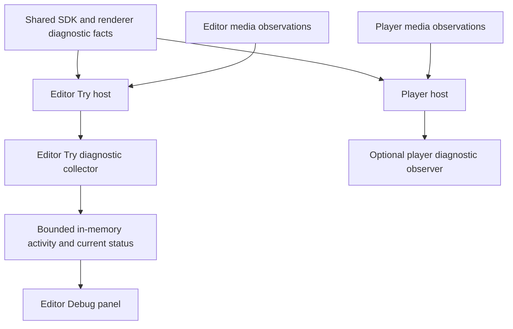

# Try debugger architecture and design

Status: design proposal. No debugger implementation is included in this plan.

Build a debugger into the editor's Try experience so an author can see whether a button press arrived, which rule ran, what changed, and why playback is waiting. The visible tool belongs to the editor. The evidence it displays should come from shared PVO runtime instrumentation and the editor/player hosts that apply playback actions.

The first version should explain execution as it happens. It should also preserve the evidence after Try stops. This gives the designer a concrete product to design before adding execution controls such as breakpoints.

## Confirmed gaps in the current product

The recent request messages explain failures after a request reaches the SDK. A component can appear unresponsive earlier in the interaction:

| Observed code path | Explanation the author needs |
| --- | --- |
| A button has no matching compiled Logic rule | Button pressed, but no action is assigned. |
| A response uses the layer-end policy | Answer recorded; its action will run when this layer ends at 00:24. |
| The same response is already dispatched, handled or pending | This press was ignored because the answer already ran or a request is still running. |
| A sandbox event belongs to an inactive component or an old scene | The event was ignored because its component is no longer active. |
| Another component holds playback | Continue was requested, but playback is waiting for Question 4. |
| The browser rejects a media play request | The editor requested playback, but the video did not start. |

These are confirmed diagnostic gaps. The reported button failure still needs to be reproduced to identify which stage is responsible.

The relevant code is in [PvoRuntimeOverlay](../../editor/src/features/preview/PvoRuntimeOverlay.tsx), [createTrySession](../../editor/src/features/preview/createTrySession.ts), and [usePlayback](../../editor/src/features/preview/usePlayback.ts). In particular, the current media adapter suppresses rejected `video.play()` promises. An error-only network log would leave these earlier stages unexplained.

## Product decisions

| Decision | Recommendation |
| --- | --- |
| Where the tool belongs | The editor, as part of Try. Available to visual authors as well as Advanced users. |
| What PVO provides | Optional structured diagnostic events from shared execution packages. No authored debug component, new Logic keyword, or debug flag in a video package. |
| What the public player shows | Keep concise viewer feedback. Its host can supply the same diagnostic facts to a developer/test observer without shipping an editor panel to ordinary viewers. |
| When recording starts | Automatically when Try starts, including while the Debug panel is closed. Capture bounded metadata so opening Debug after a failed click is useful. |
| Where history lives | In memory, outside project saves, Undo and exported videos. Retain the last run after Stop; a new run or project switch replaces it. Copy a report to retain it longer. |
| First release | Activity, current state, requests, component readiness and the current playback wait reason. |
| Later execution controls | Cooperative breakpoints at rule/action boundaries after trace correctness is established. |

## Screen layout

Add a labelled **Debug** button beside the existing Try/Stop control. It carries a small error count when the panel is closed. Opening or closing the panel does not restart Try, resend requests, or pause playback. The debugger remains reachable after Stop with the label **Last run**.

On desktop, open a resizable dock below the video, in the region currently used by the timeline. Provide **Timeline / Debug** workspace tabs so timing remains inspectable. Keep authoring controls disabled during Try. Inside Debug, show the activity list and selected details side by side when space permits. Preserve the previous timeline selection, scroll and panel height when returning to editing.

On mobile, use the existing lower dock as a resizable bottom panel. Its normal height must leave the video and playback controls usable. Selecting a row opens details within that panel with a Back control; avoid squeezing two columns onto a phone. Explicit expansion may show more detail, but the standard opening state should keep the video visible. Follow the existing safe-area and keyboard behavior.

The inspector and library are already disabled during desktop Try, and the mobile editing dock is currently hidden. This change needs a deliberate Debug region that remains interactive while the authoring regions stay disabled. Reuse the existing panel geometry rather than placing a floating console over the video.

Illustrative desktop layout:

```text
Video preview and existing playback controls        Stop  Debug 1
----------------------------------------------------------------
Timeline | Debug          Main 00:24  Paused: Question 3 request failed
Activity | State | Requests      Component: All      Copy report
----------------------------------------------------------------
Activity list                    Selected interaction details
Question 3 > Answer A             Click received
  Answer recorded                Answer recorded
  POST /scores — Failed: 404      Rule selected at layer end
                                 Request returned 404 in 320 ms
                                 No error route; retry available
```

Use the existing PVO visual language, readable text, restrained status colours and icons with labels. Do not use colour alone. Rows must wrap or open details instead of truncating the explanation into an unreadable horizontal strip.

## Information the designer should include

### Current status

A status line stays at the top of the panel. It identifies the scene, video time, and primary observed playback state: **Playing**, **Paused by you**, **Paused for an answer**, **Waiting for media**, or **Stopped**. If a component owns the pause, name it, state the reason and link to its details.

Show request activity separately because it can overlap playback: **Playing · 2 requests running**, or **Paused — waiting for Question 3 · 1 request running**. A pending request alone must not imply that the video is paused. After a failed submission, distinguish **Paused — Question 3 request failed** from an unanswered question.

Requested playback and observed video playback must be separate facts. A store value of `playing: true` does not prove that the browser started the video. Video time and elapsed request time must also remain distinct: a request can take several seconds while the video is paused on one frame.

### Activity

Activity is the default tab. Group records under the interaction that caused them, using the component's readable label and button or field label. Opening a row reveals its ordered stages and result.

An illustrative interaction would read:

```text
Question 3 — Answer A
00:21  Click received
00:21  Answer recorded; waiting until layer ends at 00:24
00:24  Logic rule selected
00:24  POST /scores started
00:24  Server returned 404 after 320 ms
00:24  No error route; component available to retry
```

Include successful, deferred, ignored and cancelled activity as well as failures. A successful request followed by a failed scene change must appear as two distinct results. Filter by component and by issues; do not require authors to read raw console output.

The component selector should show readiness, active timing, current interactivity and whether an action is assigned. Selected component details should expose these facts plus relevant layer order. A temporary outline may locate that component in the preview without intercepting its clicks. If no input event was received, say that; do not invent an overlap or network explanation. Show “behind the video” only when known layer order supports it.

### State

Show current runtime values such as the quiz score, captured answers and stored responses. Support pinning a few state paths, such as `score`, for easier watching. Values belong to this Try run and must be read-only.

Activity records show the affected path and bounded, permitted before/after values when state changes. Selecting an old event does not turn the State tab into a historical snapshot; label it **Current state**. Retain the final state after Stop. Reconstructing arbitrary historical state and editing values are outside the first release.

### Requests

Each request has its own row: component, method, destination host/path, running time, status and result. Details connect it to its original interaction and distinguish request-policy rejection, HTTP failure, timeout, cancellation and a browser/network failure.

A 404 means a server answered with a missing-resource status. A browser/network error alone cannot prove that the server is down or distinguish DNS, TLS and CORS. Show the evidence available and avoid naming an unconfirmed cause.

Payload inspection is useful for checking a submitted score or a returned leaderboard. Provide an explicit **Capture data for this run** setting for bounded request/response data and historical values. It applies to subsequent activity; explain when data was not captured. Authentication secrets and sensitive fields remain masked. The normal log contains metadata, not complete bodies.

### Controls and empty states

Use **Follow latest** for automatic scrolling. Turning it off must keep collecting activity and must not pause playback. Selecting an event should not seek the video or execute an action.

Provide **Copy report**, **Clear completed activity** and **Close**. Clearing keeps pending operations and the current state visible. Copy previews a sanitized report with version, timing policy, stage/reason codes and linked events; captured bodies and private state values remain excluded. Never automatically resend a request from a log row.

Use **Stop and edit** to leave a running Try session and open the affected component's Logic or Action view. After Stop, use **Open component**. Selecting a row alone remains read-only. Exact source-line navigation is a later feature; do not design a working line-number link before compiler support exists.

Before the first interaction, show **Listening — interact with the video to see what happens**. After Stop, retain the trace with **Last run — stopped**. Opening Debug during a run should show the already collected activity immediately.

## Architecture and ownership



The panel observes execution. It does not become a second implementation of PVO actions, request rules or playback policy.

The diagram describes diagnostic data flow. Editor and player remain independent consumers of shared contracts, and neither imports the other's internals. The panel is a detailed inspection surface, not a second notification system: do not generate another toast or live announcement for every event already reported on a component.

| Owner | Responsibility |
| --- | --- |
| `packages/pvo-sdk/diagnostics/` | Proposed shared event types, bounded data helpers and diagnostic observer contract. Extend SDK action/request/state instrumentation through its public API. |
| `packages/pvo-code-runtime/` | Report renderer readiness, received input, invocation queue, rejection, worker failure and disposal. Expose narrow structured callbacks; hosts normalize these facts. No editor dependency is required. |
| `packages/pvo-language/` | Keep parsing/validation diagnostics. Later add stable rule/action source spans to compilation results. No network, playback or trace UI. |
| Editor Try and media adapters | Report accepted/deferred/ignored responses, missing rules, timing holds, actual routes, requested versus observed media transitions, cancellations and run lifecycle. |
| Player adapters | Report equivalent host decisions through the same public contract. Preserve intentional host differences rather than claiming identical traces where behavior differs. |
| `editor/src/domain/debugging/` | Proposed pure event grouping, filtering, status derivation and report rules. No React, store, DOM or network dependencies. |
| `editor/src/state/debugging/` | Proposed transient collector/store and selection. Keep diagnostic state out of capture history and persistence. |
| `editor/src/features/try-debugger/` | Proposed views, details, watches, responsive dock and navigation to authoring. |

The current SDK already has runtime subscriptions, but they contain full state, responses and raw URLs. Do not connect those directly to the visible log or copied report. Add a separate optional diagnostic boundary with bounded fields and exception isolation. A broken observer must never throw into playback or action execution.

## Event contract

Use typed facts and reason codes rather than arbitrary strings. Each record needs a run identity and sequence, elapsed time, event kind, and severity. Component/scene identity and video time are attached when applicable. Each interaction, action and request has its own identity, with a parent identity to connect nested work.

Async completions retain the identity of the run that started them. They cannot become events in a newer Try run. Report cancellation as cancellation, rather than a failed server request. Stopping a run must unsubscribe and dispose owned resources while retaining its finished trace.

Record these event families:

| Family | Required facts |
| --- | --- |
| Session | Started, stopped, failed, run source revision and application build. |
| Component | Ready, unavailable, render/compile failure, active/inactive transitions. |
| Interaction | Received, accepted, deferred or ignored, with target and reason. |
| Action | Selected, started, completed, failed or skipped, with applied outcome. |
| Request | Started, completed, failed or cancelled; request identity and elapsed duration. |
| State | Changed path and bounded permitted before/after data. |
| Playback | Hold/release reason, seek/scene request and result, actual media playing/waiting/error transitions. |

Record transitions rather than every animation frame. Use a bounded event/byte budget with an explicit count when older completed activity is discarded. Pending operations and current status need separate bounded tracking so trimming history does not hide an outstanding request.

Keep observations local in memory. Capture and copy rules must mask authorization/cookie headers, credentials, URL query values and private form data. Render remote and sandbox text as text. No telemetry service, account or external debugging server is needed for this version.

## Source navigation and execution controls

Today the compiler supplies typed Logic rules and an empty generated JavaScript body. The host selects and runs the rule after a pick/submit event. Successful rules do not carry the source spans needed for accurate runtime line highlighting, although compile errors have line and column information.

The first release can reliably open the component and its Logic section. Each trace must retain the source revision that actually ran, including when the editor uses the last valid source while a draft is invalid. If source changed after a run, show that difference instead of linking to a guessed line.

For a later release, add compiler-produced rule/action spans and cooperative **Pause before rule**, **Pause before request**, and **Pause on failure** controls. These fit PVO's checked action model. Execution pause must have its own state; it cannot reuse the video's unanswered-response hold or trip the worker watchdog. An already sent request cannot be unsent or rewound, and Resume must not silently repeat a POST.

Arbitrary JavaScript evaluation, line stepping, changing live state, request replay/mocking, remote sessions and cloud log history are outside the first release.

## Delivery sequence and acceptance

1. Agree the grouped interaction model, reason codes, source identity and collector lifecycle. Add the shared observation boundary with tests that enabled/disabled diagnostics produce the same actions and results.
2. Instrument component input, Try decisions and actual media transitions alongside SDK actions, requests and state. Cover native controls and compiled components in editor and player adapters.
3. Build the desktop dock and mobile panel from the approved design. Add retained last-run inspection, state watches, safe details and report copying.
4. Verify the real button/quiz workflow in Safari, plus browser parity and sandbox tests. Publish a beta for review before deciding on later execution controls.

Acceptance must include: no matching rule; deferred layer-end action; duplicate press during a request; missing response hold; 404/network/timeout/policy failure; successful request with failed follow-up; concurrent requests; stopping or changing scenes during a request; late results from an old run; final-frame errors; invalid draft versus last valid code; browser play rejection; and no input received by the component. Every case must show the last confirmed stage and a truthful reason where one is known.

Check that long runs remain bounded, diagnostics cannot change action results, sensitive data stays out of ordinary reports, controls remain usable on phones, and existing sandbox/request policies stay enforced. Local browser tests should use reachable fixtures; public HTTPS beta tests need a reachable HTTPS service rather than assuming they can access a local HTTP fixture.

## Screens to design first

Design a desktop dock and a mobile bottom panel for the same seven states: listening before input; answer recorded and waiting for layer end; successful action with a score change; failed request with retry available; ignored press with an explanation; component unavailable or missing a rule; and stopped Try with the retained last run.

Start with Activity and its selected interaction details, then reuse that visual hierarchy for State and Requests. Keep labels plain, preserve the video interaction area, and make the current wait reason visible without opening every row.

## Implementation references

- [Architecture](architecture.md) and [notification policy](notification-policy.md).
- [Desktop workspace](../../editor/src/features/desktop-editor/DesktopEditor.tsx) and [mobile workspace](../../editor/src/features/editor-layout/EditorWorkspace.tsx).
- [SDK runtime](../../packages/pvo-sdk/runtime/PvoRuntime.js) and [sandbox session](../../packages/pvo-code-runtime/session.js).
- [Try runtime bridge](../../editor/src/features/preview/createTryRuntimeBridge.ts) and [player component actions](../../player/actions/components.js).
- [Compiler output](../../packages/pvo-language/src/compiler/mod.rs), [Logic model](../../packages/pvo-language/src/logic/model.rs) and [compile diagnostics](../../packages/pvo-language/src/diagnostic.rs).
